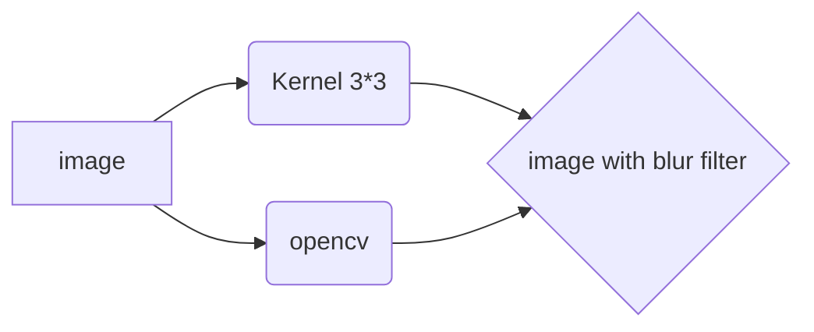

<p align="center">
 </a>
</p>

<h3 align="center">One of the  <a href="https://github.com/mrl-hsl">MRL Humanoid</a> tasks 👾</h3>

<div align="center">

&nbsp;&nbsp;&nbsp;&nbsp;&nbsp;&nbsp;&nbsp;&nbsp;&nbsp;&nbsp;&nbsp;&nbsp;&nbsp;&nbsp;&nbsp;&nbsp;&nbsp;&nbsp;&nbsp;&nbsp;&nbsp;&nbsp;&nbsp;&nbsp;&nbsp;&nbsp;&nbsp;&nbsp;&nbsp;&nbsp;&nbsp;&nbsp;&nbsp;&nbsp;&nbsp;&nbsp;&nbsp;&nbsp;&nbsp;&nbsp;&nbsp;&nbsp;&nbsp;&nbsp;&nbsp;&nbsp;&nbsp;&nbsp;&nbsp;&nbsp;&nbsp;&nbsp;&nbsp;&nbsp;&nbsp;&nbsp;&nbsp;&nbsp;&nbsp;&nbsp;&nbsp;&nbsp;&nbsp;&nbsp;&nbsp;&nbsp;&nbsp;&nbsp;&nbsp;&nbsp;&nbsp;&nbsp;&nbsp;&nbsp;&nbsp;&nbsp;&nbsp;&nbsp;&nbsp;&nbsp;[]() &nbsp;&nbsp; []() &nbsp;&nbsp; [](http://creativecommons.org/publicdomain/zero/1.0/)
&nbsp;&nbsp;&nbsp;&nbsp;&nbsp;&nbsp;&nbsp;&nbsp;&nbsp;&nbsp;&nbsp;&nbsp;&nbsp;&nbsp;&nbsp;&nbsp;&nbsp;&nbsp;&nbsp;&nbsp;&nbsp;&nbsp;&nbsp;&nbsp;&nbsp;&nbsp;&nbsp;&nbsp;&nbsp;&nbsp;&nbsp;&nbsp;&nbsp;&nbsp;&nbsp;&nbsp;&nbsp;&nbsp;&nbsp;&nbsp;&nbsp;&nbsp;&nbsp;&nbsp;&nbsp;&nbsp;&nbsp;&nbsp;&nbsp;&nbsp;&nbsp;&nbsp;&nbsp;&nbsp;&nbsp;&nbsp;&nbsp;&nbsp;&nbsp;&nbsp;&nbsp;[](https://linkedin.com/in/iampavangandhi) &nbsp;&nbsp;&nbsp;&nbsp;[](https://iampavangandhi.github.io/) &nbsp;&nbsp;&nbsp;&nbsp;[](https://twitter.com/iampavangandhi) &nbsp;&nbsp;&nbsp;&nbsp;[](https://instagram.com/iampavangandhi/) &nbsp;&nbsp;&nbsp;&nbsp;[](https://t.me/iampavangandhi)
</div>


<br /><br />
<div align="center">
   <h1>Welcome to our vision task  </h1>
</div>
<div align="center">
</div>
<br />


Thanks 👨🏻‍💻 Mr. **Alireza Mohafezatkar** for being the leader and guide of our group for this project.🙏🏻 Group members for this project : 
👩🏻‍💻**Yegane Almasi Tabar**,👩🏻‍💻 **Elahe Yaghoubi** and 👨🏻‍💻 **Amir Mohammad Parvizi**.

One of the projects of ([MRL-HSL](https://www.bing.com/ck/a?!&&p=b14cb7c50279c4740f8b0c55a298b4824311331e3082172cb69786d536ceb430JmltdHM9MTY1NDkwNTYwMCZpZ3VpZD0yOTg5MWM5ZC1jMzUzLTY3NzUtMGM5Yy0wZDI4YzI4MTY2NDQmaW5zaWQ9NTE2MA&ptn=3&fclid=29891c9d-c353-6775-0c9c-0d28c2816644&u=a1aHR0cHM6Ly9zaXRlcy5nb29nbGUuY29tL3ZpZXcvbXJsLWhzbA&ntb=1)) 🤖, Email : [MRL-HSL Email](mrl.humanoidrobots@gmail.com)

### Editor:

<p align="center">
  <!-- For more icons please follow  https://github.com/MikeCodesDotNET/ColoredBadges -->
  
</p>

### Languages & Tools:
<code>
</code> &nbsp;&nbsp; <code></code> &nbsp;&nbsp; <code></code>

# Image Kernels ⚙️
An image kernel is a small matrix used to apply effects like the ones you might find in Photoshop or Gimp, such as blurring, sharpening, outlining or embossing. They're also used in machine learning for 'feature extraction', a technique for determining the most important portions of an image. In this context the process is referred to more generally as "convolution" (see: [convolutional neural networks](https://en.wikipedia.org/wiki/Convolutional_neural_network).)

for apllying 3x3 **blur**.

                    0.0625, 0.125, 0.0625
                    0.125,  0.25,  0.125
                    0.0625, 0.125, 0.0625
                    
for example :
<br />

<p align="center">
 <img src="[data:image/jpeg;base64,/9j/4AAQSkZJRgABAQAAAQABAAD/2wCEAAoHCBUUFBcVFRYXFxcXGiAdGhoYGxsbGB0bHhoaGxgYFxobIiwkGyApHhoaJjYlKS4wMzMzGyI5PjkyPSwyMzABCwsLDgsOHRERHT0pISA0MDswMDA9PTIwPTIwMj07NT00PjY9MDA+PjAyPTAwPTAwPj06MDAzPjwyPTI9PjgwMv/AABEIAKMBNgMBIgACEQEDEQH/xAAcAAABBQEBAQAAAAAAAAAAAAAFAAMEBgcIAgH/xABOEAACAQIDBQQFBwYLBwUBAAABAhEAAwQSIQUGMUFREyJhcQcykcHRFEJSYoGhsRUjM5LS8CRDU1RjcoKUsrPhFnOTosLD4hc1dOPxNP/EABYBAQEBAAAAAAAAAAAAAAAAAAADAf/EABoRAQEAAgMAAAAAAAAAAAAAAAABAzEREiH/2gAMAwEAAhEDEQA/ALRY3tvEgFrXHpHvq9dqv0h7RWGXLsMDHD40ef0gm3r8mBn+lj/t0GoHGWxoXQEfWHxpxLykSGUjqCCPbWD4nfctcc9gBLE/pOpJ+hR3Zu/pXDlfk4Oj/wAZ5/0dBqOL2lbQibttZ+k6j2SaHWd4LZJBvWf116+dYzvBvKcSyE2gmQEevmmSPqiOFAluxrFB0zh8ZbcAq6MTwysDPlBqTWJ7p72m29m32IOWRPaRPdblkrUdl7cN5c3Z5e9ljNPIa+qOtAcpV8FfaD5Nfa+GhuP2n2RAyTIn1o91ASmmheXNlzLPSRPsoLc29/R/83/jX3AW891bsxmk5fNSImgKY7GJZTPcYKsgSeZJhVA4liSAANSal1St2r/5QxeIxb62sNcNjDKfVDKPz1/oWbMFB5LI5mre7kGABw+PwoHqVMdoegpW7hJII4AH2lvhQP0qaLmSBFLOfCgdpU3bYmZr4rElhpoY+4H30DtKvGvhSU8Z5fAUHuue09L+024JYPlbY/8AXXQlc0ejbdr5dcvL2pt9mimcmeZaI9YRQGML6Vtq3XFu3btO5mFW07MYEmFDToATU7/b3b/8yb+63vjQ/cfA9hvELObP2b3lzRExauaxJj210DQYd/t7t/8AmTf3W98aYxnpI21ZXPdwy21mM1zD3EWTwEsQJ0PsreKzj05f+2r/AL9P8NygouH9LW1LjhLduy7NwVLTsx56ANJogd/tv/zJv7re+NVfdWz8ka1tGe0NqX7L1c2jJGfWOMzlNXK76btCPkI1H84/+qgDn0rbWHG1a/4L/tVNt+kDbrKGXBllYAgjDXSCDqCCDqCKpN7ejMAOyiPr/wDjWl4P0nnDYOz/AAQOLdq2v6bLMKqz+jMUFdxnpV2tZbJdtW7bROV7Lq0HgYZgaj/+se0emH/4bft1Xd8d4fyli+37PssyomXNniNJnKvXhFB8Vhckd6Z8IoNPXf8A28eGDJ8sLe+Nff8Ab3b/APMm/ut740S2F6Wzdbs/kcZUme2mYKjh2fjWobHx3b2Ld3LkzrOWc0eEwJ9lBjv+3u3/AOZN/db3xpVuNKg5y21j1RwDm1WdPM+NV9rhPM+001tHFNccENmgRIjqTGnnUi1gbpnuMfZQRbjca+JdbQZmjpJipTbMvEx2bfd8anYHYF1ss2mPe9/nQD0eONfe1HjVnTdhz/EN7T8a+Nuvc5WG9p+NABweICup1EdPI1atl7UIX17g73Inw8aHtu1eGosOI/frXn8nYlNBbcDjwH78qDR93t4UU3M7XTosc/pTxNXrDYpWVWEwygifETWCWMc9uczZZ4SBrH2eNX/dbb7XHRGugqLfCF5ARwE0Gh5waYvWM/IadaEYvGXMrG23I5YAOseI607u9iLzo5uklge7IUaZfqjrQFhYX6K+wV6yADQAaaRpQa1igSneumVk6PE92JMTzPLzjSnsLfkLBukkx3lYDLmYCcwjh9sRpWcqXHZFW9DAI2eyn1lv3Aw5g92Zq7YknvRM5dMsZvnerm0npOlVfZ9j8nYy8G0wuNuC4j/Nt4htHtueQeAVJ0kZeMTbLicTPLhE8J8fGtTAScWRGo7oymELFg0kOIAUkSuYaAAGJMAriHdRcNtQzhBlDEgE96NQDUe5tW3kFxSXQlhKqR6isz+sRwysI45hHIwSt24JMzIA4dJ+NBHvl8jmDny8LZBMxwQuACfEihBbGSmkr+aBPckgdp2pIjuse4eg0Gmpo1jLq21Z2YBFEsSNFA4sTyAGpPIAmmWxihVaZzZSFiHysyqGysQQJYT8dKBzEvcAJtqrNK6MxUROpkKa8YgvkuZcweRGTKTOVeBYRHiRw5TUxFidaauuEDuT3fWOhMAAAnTymgGr8pzDvMVzqSCqL3IhlJkxHrzz9XSjC8T5+4UP/KS9wjvLcAKsBpBdUU6mSCXWCOWtEAOPjQe65W3P22mEe4zM4zqAMngZ11FdU1x5hLBcmBMUF4wmwMVjMR2mGuKjXiXR2d0cAqWOZlUkErI+2ti3J2NicLhVtYm6Ll0MxLB2eQTIGZwDwrDt2Nu4nDX7ZNzs7aBgCVtwBkZVBJB6gVvG5+1GxWGW6bguS7DMAsQDEd0AUFiqh+mC3mwKDT9OnH+rcq+VlHpd3lw9zB9nYxFtrqX1zKrAsIDhpHgdKDNr20EFpsNr2mUrw7snXj5HpQMbOfmV9p+FM23uPcBXvOeGg6dOHCi1rZWOcErbYgaEwvnQDceNB50zbvtwZmK9JJHhpUr8m4l9MjGPKjWzdxce5VjhHZGWQZWCCJU+tQD8JtK0tvKQZ1+aPs1r6dp2jyP6oqwv6PsZBjB3OHUftVBv+j3aOmXB3PHVP2qAFgcYqOTqJBGnmDVpW/iDhw6XriqVBUC46wJ5AHSho9Hm1P5nc9qftU5iti7VsWiLlq4lq2NZCQBIjXjxIoL/ALhb7W8Jhmt4pr1y4bjMG1fulUAGZ2nip08aVZlhMTC/nWAaecDSBHDxmlQSdmbKRhJZvW8Og8KvGF2QgJ7zfd8Kg7Eskodfn+5aso0oGbOwrcg5n1/q/CiOH2cqAAFjBnWOs9K+WRw8qm2+FB6t26cyUlr2tA09uRUa9s9W4luEaR8KKIlJ0oKFt7d22AkNc4n6Ph4VXNi7WeziGCqpyZ0GaeAMSYPHStSu2+FZxvDgCvavmBm4dPNjQafu1izfsW3YAFywIXho7LpPlVmwtkIrQT9vlWZ+j+8Bbw6x886+dxq1k0Ffs2xmtntU9QyYH1Z1zaU/htFUZlb84dAoBnMxJ9bTQg/fzorlB5D2V9yDoPZWdVbk80+XbaupVlDKdCGAII6EHjXthIg869VBxWIZWgRETqPE+PhWpHfkduI7NImYyiJAygx/V08tKk0M+Wv9X2H409g77MWDRoFIgRxLTz8BQSLtsMIYAiQYIkSDIP2EA/ZXk4dcoTKuURCwIEGRA8CAfspu7eYEgR7P9a8/KG8PZ/rQTabuIGEEAg8QRI9leMPdLTMadK+qxJbXgY4fVB99B5+TJ3TkXukldBoSZMdJOtSK8Qev3UkPGevuFB7rkLZd0qWiNRXXtchbKt5i3lQTtotNpj1j8RWh+jDei5Zw9nDKiFGvZSTmzd9wDEGOdZljdnlQz5h5R1IHvpzdL/8Avwf/AMm1/mLQda1yXvFeJxOIWOF65w4/pG+NdJb04gIbUiZzf9Nc3/Lhaxd5iCQXcQPF591BYdzd2rd57Ds1wFyZjLA9YaSvhWqYbYFu0Ciu5DGdSs6wOQ8KBbrWO0w1q8DAIJynj6zCpmPvAMBHL3mgL4f0c4ZJi7eM9Tb9yUUt4g4dRbWCLYCKW4kL3QTEawKqeGwuWeFFEbugeAoDybYcicq/f8a83Nt3B81Pv+NCkPdr4j0Bf8tP9Ffv+NM4/Zy4y09q4zILohikAiCD3cwI5DiDXzDYQgzI4fCmsXb0YUGfbw+jTDW7oVbl8jIDJNvqwjRB0pVp+xLgRCCJ7xOnktKgznB2QgICgazoB0FT0QmoiOvMgfaKeTFAfOX2igIWliPKptnhQtMWunfT9YfGpljECBDKftFBMYV7RaYW5TvbBdSwHmRQSQDXlppoY23/ACifrL8aXyhD89T/AGhQJ0qn7zYWbbwo9fw+kauWYHgQfKgm8dgC0xg+sPxoIW5doqcOIiH/AOs1rFZZuw8XLI/pB/jrUbTTQQ8JdknUnT31PFMWsMqmRPtp8UDV8OVOQgNGhYSJ8QCPxoXjFbLDQz5NcsoCe9wMkr5z40aqDj1UKztm7q6gEcBrpPPWgrdrC3RHrCAnG4zTFxWbQ8O6CPGTJM0YthyLotlVfIuUsJE9+NJFeWvJ2JujPGVmAbu6LMhzByHTgdRwIkEUUsYYKSQSZjj4TH4mghY1WysNGfLyJQExyIJKj7SaEpgbunef+KGtxjrbJLsddcykAjmevGrBiVADOSdFJOqgaCeLaDzJihy40Mtt1Vitx8hzFUZROXMVIzTmgZeInWINBKK3CG7NlVsy6spYROogMOVesRbZkuKNWJA0Zk1yrJBBkdYnwmpdq0FmJ161Fx2JWyhdsxBIkKATwA7q8TwGg1oIaYK7mBz3Izq0M8iAMrKYAlSNQPpamRRheJ8/cKh3cbCode8UGsRDsFEMAVY68AamBY8aD3XIOzb6oWzGJHj7q6+rjvCqpJzH74oD1tDdARe9m1APAxrz8qsO7Bwti/h7d5EF7trZXuZjrcXIQwBj21W8G1xcvYKXuAd1VBcnTWFGp7smtH3N3UXErZxeKs3FvrcHJ0ACOCkqRQane7G5GdVeOGZZieMSPAVg25Oz7d/auLtvbS4gF0hXVSoi8oBAbQaEj7a0H0lbwXsA2HFgoBdFwtnGb1DbyxqI9dqz/wBFN9n2lfcxma07GBpJu2yYFBoGJe3azWLQFvLoqIMqie9AjQcZ+2oS4G7c70TGklh58z40S2imHFx3e4i3NCQbiiDAAlSdNIqOm1bSaLdtQdT31PvoHVUp6/PhzorZRSq6DUDl4VGvYrBP/H2jHS7b+NSGuoEHZuraDLDBpHURx0oGcRafNp6vn7dK94ayzAwKaXEsWAPAkA6cuetEbOKsW5D3baTwz3FWfKTQeGS6OZH9r/WmpaYJJPOTRM7UwLafKbB8ryftUy93Ck5lu2j0IuIR+NB6wmi69fcKVNXLhJ/Nd9eZXvCekjnEaeNfKDML2IkjSnks+NfMVg2J0jh8fCoR2Zdbgw/Wb4UDt0ZJPGDUzZ2O1RcvFhz6t5VBOz7ijvEGOOpPupzC4dg6cNGH4igvOATODygioe17UINfne5qm7DOj+Y/A05tfDlkAEet7moKWW/OR4+6i2CTuz4+4UD2rsy4XfKVEnTvEdOgr1srZt5V7zg96fWY6aeFBbcHics6TMc/OlvOf4Lm6lPvprBpx+z309vKZwseKUAHd7F/nrK5f4xdZ+tWmnG5NMsz41k2x8G5xNogiO0Xmeo8K1bA28gIeCSdOf40DeA22brEZAIE+tPOOlTbWLzOFjrz8Cah4THWyTCkafRA99TbOKRmAAMnwHQ0E2lSphyc3EjQdPGgeivtRsx+kfu+FKyxzMCZAAPLmWn8BQSK+ZR0pszJ1P3Utep+74UD1KmrcydZrysktqdDpw+ip95oHopq8zBGKrnYAwshcx5CToJ617y+J+6knPz9woIWytppiEz25BVirowh0dfWt3F+aw08CCCJBBrka2gPExXSW08T8k2zhiuiY+29u4ORuWgDbc/WhgnkfCsz9DWLtW72IN1MwKLHdVoOY/S4UEbY+EGAtWtogm4UQHsz3Qe0UJGbXhnnhyrQ90vSAb6Wh2AXtLmT9JMSwWfUE8anbKxNq7jAoTuszwrKuWArEacOVWh9mLnDKltQCDooHAzyFBmXp2jNgpMd29+NiqP6M9odhjHfLmm0wiY4vbMzB6V0ZjcGtwrmVWyz6wBiY4SPCsH3Bsg7WxawIC3dI00vINKB3aV35Xj2QjJ2rASO9EW18p9WrDgvR6rox7dhBP8AFjoPrVXt7th3mxV57bIslcpDMpH5tByGnOoWytz9p3kLpiQFDQQb10awDyU8iKAftTYYwSqwc3O0OWCAsQJnnNWTdLeY3Llqx2QAW3GbPM5FA4ZefnUHEbvYi0AbrI4bRe+zQefrKIqHsLZty1ijdYrk78BSZ73DSBQbRs/Zfa2u0z5ZnSJ4SOM1Sd/tigPZ7/zX+b4r41oO5twNhEP1m4/1jQzfbZ7XXtFcuitM6cSvh4UGPbp7rDEX3TtCsIzSEB+egjj9atHfcpbGF7Tti2ReGQCe9HHN41llvdzF53Nu6qGTwdl0zcNB5Ue2TsPHWGS/fv57KSWQXHYkEFR3WAU94g8eVBc9jb0HB2zaFoXJYtOfLxAERlP0fvpU1gLiX1LKugMd4CZAB8etKg8LbQ8RTyYRRwX8aj2Dp9tEFagF4q2oBkc/fUexbBZYHzh+Ne9o3TDcPW99R8De7ycPWH4iguGybcBtOYqdcSR3uFQdm39G4cRU3E3dBw4+40EC9s5GYnJM+J+NOYfZ1sDVOfU/GpNp5gVIVaCP8iQeqv3mou37KmxAGsrRdVqHtWyDbPHiKARu/s2WtP2Z0cGfJvOrnfttIyg1E2BhgLKGToT/AIzRrLQU3Z+FvqxzIwEcwOootgEuC6uYGNZ/VNGDaHWktkAzJoFftllIVipI0IiR7QR91RTZYJkLZ2yxLgQTr6wUCR7qIUzdUQTzA6nl5UAA7DfLAuhe4Fyhe6IMgDh3Z1jTXw0opiLLOLiq5RmQAMsSD3uoNQrmNum0HW0ytmYZGzMdEZl4RGZgoB5BhMGQDKWwCSOfiTwmOPmaCNeskoySGYrE3ACpMcXVYBHgIoV+QWkfnIAFsAADurbz90E8dGgHQgyfAl8a+RGdUZ2EQikgtqBA5T0mB1IEkR3xDdmrBGBOQn1iBLKrKRIaQpOsQIk9KB/E2WcEK7IZUyuWYBkjvA14v4culxO6xJA74BB7qySAInnwieVTQoFR8UciM4UsRrlBMsdBAjmeHCgH29jQwbuiHV9CxgqMs68ZXuwdF4jWjC8T5+4UK+WXD2RFtlzespzEjvqpBbgCqlmPEHLoSNSRvXAis0MYBMKCzGBwUcSfCgou+9k3dq7JtrxV7txvBUFtpPgcpFZH6P8AFJbuXS7BZQRP9at62Jsu4198biRlvOgt27chhZtA5shYaF2PeYjTgBIEnnjdDBrde4GYiFHCOvjQWw3dp9s1zBhySSbbKqGVIMkZxr3Z405c2nvMpgm6D/u7H7NSdz94riY+3hstvs7edQ5zZiFttBJmJ06Va94N5Ht3SFFsjKDrPj0NBnO1d8tu4XL2957eecua3Z1yxMQnKR7akeiO4TtG7cvHV7LsWOksblsk6eZob6RNrviTYzKoyZ4yzzyTMk9Kt272w7WGYXbbu7NbylWKkQ2Vie6AeKigtm0LGHe63qkkjmde6KfwVkW1K2xlUmSBrrAHPwAoMhm4HPGfs4RRvDP3Tw5/hQVzaT24XtiAJ7s6axrwoTgsKbl2EXMpzFY5rqQR9lDt6Nq3GS33V9Y8j086Obl3puWiSATb11+pQX/d+w9vCZQpVhnIHOZJH305YYGflWh+Zm005xl+yiOz7i5B3hxPMdaAb3YiGt5YPdbx5jpQRH2DbUlhaiTxk89etFrGzcK9oW7iqZEMpLdZ5GlbxRuAKY0E6ez302whqCHitkW7Zy4e3CRJgkjNqDxPQLSozhEBWSefwpUGcWLun20RtrNBMHcBHHn8KJjEBeJI9tA3j8Ocra8/fQG/hCX4jlUvG4/Vu+3rHr1r1gXD5SdZbn50ErZWEIDajiKseF2cVM5hw8fCh9m1xyiPLSp4x6pqzHpz40D9kZbgHQ+6i1ppFArWOtu4CmWPDQ9OtFsM+nHn8KCTSxJ7nsrwGFQdoYsBD3jx8aCXa2qtuEKkxzBHPX31Mt7YU/Mb2iqe+KBacx++nbeK+sfvoLK22F+g3tFSsDtEOyqFImenQn3VVlxS9fuNENiXgb9sA/S/wtQW+lSpUCpUqVAqVVfF33FxwHcAMdAzRxPjTXym5/KP+s3xoLbSoFsa8zOQzMRlOhYnmOtHaBUqVKgVcZ12ZXHNiwzzAmKC1DZRfCpDAZkQ8D4GhSbvsbiW86y7KswYGZgPfVr2JiLdpLTX/wBEqAMCCw1WF7ome8RQbeHalp8bbfDsVtjJOUFBmDSTlgeFA3vBsFtnZA7rc7TNGUFYyZeM8ZzfdR70f4I4fEtcJDBrTCBoRLo3PyoDvljzeNrvs+XP606Tk4T5VP3H2h/CCHdiotNoZInNbjT20Gg4jHBrhGUiT7hRTZ+zGuqWDAQY1B6A++hNtVZgyga8DH2UVw22LeHRkuOVYywADHSInQdQaCBtrdx8qfnF4nkelZbj913N67+cX9I/I/SNE8Zve5VZxN4+bP0q07u43C3DazhXZkBYshJLZZJJI1M0ETd3cu5cwgQXUGfOklSYzErJH21bd0vR/cwaXFa8j52B7qMsQI5mot5LiXBcskph0IYhDlUBTNw5B5HlrRGz6QMFh9MRfYFvVlLjaDjwUxxFAP3KxYXFXRB0Rh/zpV7v3Jtl/Dh9tVLCbTwWKYpgAouwXcrbNslJAaWZRPeZNPhVgssRbCOTmA1HHnQRb1vOZGmkfv7aVTrNoEcBxpUGO7Jxcoe8vreHQUXdpqjbHxWVSInv9fBauNm5M6UHh8GpmQdTRPZeCQBJkd7mfGvltJjyqXZtaDWgNYazb11H6wr5jtloVEKx15SeRpnA4fQ60ftNHsoKPYR0xIXKwUMdSD9E8TVswjypkjj7hTGMwkuzzxPCPspoPkEcedBLa94igePvk5hp63vqSMRn5RFCHv5nZY5nXyNB5Jr52jfuK9EUu0oPput+4ovuzeY4m0D9b/A9B880V3YH8Ltf2v8ALeg0SlSpUArFviRci2qm3pqQJ5TrnHjyorSpUFG3iUktAYkXkPdmYF1Sx05ZQaCXcG63LjMjXbcPpBBuNcuBkDie8ttZE8IIiSIq839kOzswZYLE8+ZnpTf5Ef6S/f8ACgj7pplCr3u7bA7/AK5jKJbU61Z6F7O2c1tyxIMrGk9QfdRSgVKlSoFXKm6OCW69wMCYUHSevhXVdcw+j+/kuXdJlB/ioLtZ2BYuW1t3A2UqJGYg6ajy1FQMZuThw2a3butAkEMzCRrxqZb2n34y9ef+lHNn7YMC3k9ZomepjhFBk+9mCNrs+6y5s3rAiYy8J86g7BxRtXC0he6RLaDUqeflVy9L6QcL5XP+3VExdjKgM8x+FBsGxMQGw1twyliCdCPpHgKbx6dowL8YjppJ+NU3dLb5BsYfsxxIzZv6zTEe+r1dXMZ4UFVxW6lgAdy5+s1Xnd3d/A2ltO7hCLayWugAEoAQZOmtQbqdp4RUbaWBDWiuaOHLxFBoFvC4J7ZtrdRlcFYW6pJzaECDx1qv7d9HeCuMncuNAPB2PEjpQ/dnYwVbVzPOS4GiOOV5iZ8Kv9jH8e799BjXotd7W0L+cG2gs3FUuMoMXbcCWiTAPsrX74U2jcUhmIkQZB1jQCq1d3RCEv2pOYnTJwkz18KlXNo/JrOULn7MRxidfIxxoCuBxMKc5CmeBgGIGsH7a+UDweJ+Vr2pGSDlic3AAzOn0vupUGKo4TQ+elGcBjxLetw/fnVdUlteNTRcj1T50F/wGKUhOPqj8KsWzgCFMfO99Zns3aLqyy8ADw6eVW3Z+20W2JuqCCT9/lQXyy6idPuFS3iKz9t5k5X1+74VNu70pAi+v3dPKgN4/FKuaZ0/0oDjNoKWAGbUe8+NBcVta7cuMEuZgx0gDXTlp4UQ2XgrlwBriEkPE+Gh5eZoDexMKQXzQeHj1rL9v32tXb7lmgXbg7pPN2A0rYHC2/qz98f/ALWS7fsrduXVAzk3HMD+uTNAV3bxHaWbbyxkn1uOjka+yjb1D3Wwdu3hbasuVgX0JM/pGI91TMWygjXlQN0W3WH8Ltf2v8t6EFhRfddh8qta/S/y3oNGpUqVAqVKmTiEHFl9ooPQYEkA8ND4aA/gRTlCMTgrTuXL6kgkZhl0EDTl8YPIV8vYCw3zlU6aqVBMFic3UEtJHOBQFEcHgZgx9o405UHCi2ggOvtXqTx+2pHyhPpr+sKB6lXhXBEggjqNa90CrmDcGwXe7EaIOPnXT9ctblYk23uENEqPxoL+ln5sCfh41YdmYMiwWIXu5j46CdNKrx2hZFsN2i9rAnXWdM2nDrRjZG01Ngg3BBzA+XOgz30m4kOcPE6dpx8ezoXhN3ryQ7lCpGgzE8YI0I6UU9I5tE2MhB0uTBP1I99Bsbte8LYi4dI5L0PhQe7+PSyTbIIdeagcxOhkHgaNbvbdTIc3aE5+evJepqsbPw7XLq3b4m2dXY6CACATHkKl7VtgOvyPW3l7xTUZ5P0ucZaDYbuKtvooIjjoB+FWPY2zT+buMEKlAY4nVdNCKwvdree5Nzt7wAgZcwUczMQPKtjw2+WDTCWj8qthxbtzrrOVc2kedBaSbanIFA8lEa06bPgKzi5vzhziEPyu3kzJmMiIkZtY6TR/Fb+YCRkxlnx73+lASxe0raCWDcY0APXx8KzfeXeC1i7t7AWQ63rndVmAW2CFDyWDEjQHlxqnJvHtTF3bluxce7lLOFVLeihsobVeHeHtq/7nbqsbtjE4mw3bGS7tIObIy6hTHCBwoLD6Lti3cLg3t3yrObzMCCWGUogAlgDxBr5Vxs4dUEKIEz+80qDmGxhWA9VuP0T8Kcu4Rk4K5nwPwrp+lQc3DAEWw8PJAMR1jwrxlcKRkbgfmmt4tbWYIrMqgFV7zNGpS2xLwoAH5w8Po+Onm/tv82xUJnGeJbTKqO4ujSShK6HhrxoMDWy/0W/VNGMHsztDBzjSdB5dR41tmL2gyM2RVcBA+rQsRcJghSdco/fizf23kMELmAaRmMjKbgDcNVOTlJ1jpIUHY+wlU22l9J6dD4VbsJhQimJ4k6+Qorg9qtcdUyqJEyHWeBMqp7xGkHTQz0NGKDL97ds3LYtZbamS06MeS9DVZ2Zge0ul2DAvmYwNJbUgSPGt2pUGOXne0SiqSF5kGddeXnXvDK14EsCIMaA++tgpUGPNbPQ+w0V3UUjGWtD8/l/RvWmUqBUqVKg+GguJt3WyhLjIoUBoUkyGU6d08gQeWvDnRulQACmJk/nfnaALoFjnKEkgxpzkieYfwYuq03LpcQRlCECZJzerMxGkwPHjRilQRu1H1v1W+FRNp53s3FtsyOyEI0MsNGhzFGjzymOhopSoI2GB1OusakRJjUxUmlSoFXImz7t20SVtk5hzVvuiuu6+RQcoNtO+f4r/AJWqdhd5sTbt9mLKka6lXnX7a6hilFByXtXF3sRlz2yMkxlVuccZ8qj3jdYZTbb7FauvIpRQclrjLwtdl2ZyxE5WnUzXnBYm9aUqtskEzqrdAOXlXW0V4uNAJiYHAcT4Cg4+GFf6D/qmpd27dZAhtmAAJytOkfCun7W2gYBCd4gKVeVJLICoMasM+o8B10aTbZCrmFtmyBmCv3pOfMAsfN7PXpr01Dlr5Lc/k3/VPwpfJbn8m/6p+FdXWtpZ3YKUyZXKkMCWKkAldIIE+PGvNvab6EouXSTmOb1wkwFjiZ05UHNm7G17+Butdt2s7MhQh1aILK0jLGsqKuVn0uY9QAMLZ0+pd/brWPy/poitCloVvWADEBJHElQIPEnwNFdn4ntUzEKNSO6ysDB4gqSPsoMX/wDWLaH80s/qXf26VbpFKg+0qVKg8MgPH94MivdKlQKmbtsFSCJEf6z7a+UqBWkCrAEacup1J9pNP0qVAqVKlQKlSpUCpUqVAqVKlQKlSpUCpUqVAqVKlQKlSpUCpUqVAqVKlQKlSpUCpUqVAqbCDjGpABPgJj8T7aVKgcpUqVBGfDqWDFQTpr5GR7CTHSTFSaVKgVKlSoP/2Q==](https://www.google.com/imgres?imgurl=https%3A%2F%2Fwww.researchgate.net%2Fprofile%2FChaim-Baskin%2Fpublication%2F318849314%2Ffigure%2Ffig1%2FAS%3A614287726870532%401523469015098%2FImage-convolution-with-an-input-image-of-size-7-7-and-a-filter-kernel-of-size-3-3.png&imgrefurl=https%3A%2F%2Fwww.researchgate.net%2Ffigure%2FImage-convolution-with-an-input-image-of-size-7-7-and-a-filter-kernel-of-size-3-3_fig1_318849314&tbnid=FC5pSHdDMuQ5wM&vet=12ahUKEwjj54bn9IL5AhUEGRoKHcrkAlUQMygAegUIARDOAQ..i&docid=VjBiothQ9ksbiM&w=850&h=413&q=image%20kernel&ved=2ahUKEwjj54bn9IL5AhUEGRoKHcrkAlUQMygAegUIARDOAQ)" alt="Blur Example"></a>
</p>

<br /><br />

Live Demo 🔗 ([click here](https://setosa.io/ev/image-kernels/))

# Download OpenCV 📥
Download OpenCV in this site 🔗 ([Download Offline Installers | Source Package Offline Installer | Clone in Terminal](https://opencv.org/releases/))

## Create files and folders 🗳
Create a folder for example **Kernel** after downloading **OpenCv**.

## How to install OpenCV on Ubuntu 📂

OpenCV is a library of computer vision abbreviated as Open Source Computer Vision Library. Open means it is an open-source library with bindings for python, C++, and Java and supports different Operating Systems like Windows and Linux. It is able to use multi-core processing and GPU acceleration for real-time operating tasks. OpenCV library can be used for a wide range of applications, including face recognition and detection, medical image analysis, motion tracking, surveillance video, 3D model extraction, and much more.

In this article, we will describe how to install the OpenCV library on Linux distribution Ubuntu.

You can install OpenCV using two different ways:

1.  Install OpenCV using Ubuntu repository
2.  Install OpenCV through the source

If you want to install the latest stable version of the OpenCV library on your system then, using the source method you can install it. Open the terminal by pressing ‘Ctrl+Alt+t’ and start the installation of OpenCV using the following methods:

## Installing OpenCV from the Ubuntu Repository 📱

OpenCV library is available in the official Ubuntu repository in Ubuntu. Update the apt cache by using the following command:

   ```sh
   $ sudo apt update
   ```
   * Install OpenCV by running the following command:

   ```sh
   $ sudo apt install libopencv-dev python3-opencv
   ```
   The above command will install all the necessary packages on your system.
   * Verify the installation by importing the `cv2` module and printing the OpenCV version:
```sh
   python3 -c "import cv2; print(cv2.__version__)"
   ```
   
## Installing OpenCV from the Source 📲
Building the OpenCV library from the source allows you to have the latest available version. It will be optimized for your particular system, and you will have complete control over the build options. This is the recommended way of installing OpenCV.

Perform the following steps to install the latest OpenCV version from the source:
* Install the [build tools](https://linuxize.com/post/how-to-install-gcc-on-ubuntu-20-04/) and dependencies:
 ```sh
$ sudo apt install build-essential cmake git pkg-config libgtk-3-dev \ libavcodec-dev libavformat-dev libswscale-dev libv4l-dev \ libxvidcore-dev libx264-dev libjpeg-dev libpng-dev libtiff-dev \ gfortran openexr libatlas-base-dev python3-dev python3-numpy \ libtbb2 libtbb-dev libdc1394-22-dev libopenexr-dev \ libgstreamer-plugins-base1.0-dev libgstreamer1.0-dev
```
* Clone the OpenCV’s and OpenCV contrib repositories:
 ```sh
$ mkdir ~/opencv_build && cd ~/opencv_build
$ git clone https://github.com/opencv/opencv.git
$ git clone https://github.com/opencv/opencv_contrib.git
```
At the time of writing, the default version in the github repositories is version 4.3.0. If you want to install an older version of OpenCV, cd to both `opencv` and `opencv_contrib` directories and run `git checkout <opencv-version>`
* Once the download is complete, create a temporary build directory, and [navigate](https://linuxize.com/post/linux-cd-command/) to it:
 ```sh
$ cd ~/opencv_build/opencv
$ mkdir -p build && cd build
```
Set up the OpenCV build with CMake:
 ```sh
$ cmake -D CMAKE_BUILD_TYPE=RELEASE \
-D CMAKE_INSTALL_PREFIX=/usr/local \
-D INSTALL_C_EXAMPLES=ON \
-D INSTALL_PYTHON_EXAMPLES=ON \
-D OPENCV_GENERATE_PKGCONFIG=ON \
-D OPENCV_EXTRA_MODULES_PATH=~/opencv_build/opencv_contrib/modules \
-D BUILD_EXAMPLES=ON ..
```
* Start the compilation process:
```sh
$ make -j8
```
Modify the  `-j`  flag according to your processor. If you do not know the number of cores in your processor, you can find it by typing  `nproc`.

The compilation may take several minutes or more, depending on your system configuration.
* Install OpenCV with:
```sh
$ sudo make install
```
 * To verify the installation, type the following commands and you should see the OpenCV version.
 C++ bindings:
 ```sh
$ pkg-config --modversion opencv4
```
Python bindings:
 ```sh
$ python3 -c "import cv2; print(cv2.__version__)"
```

## If You have Error 🐞
For easily execute the code, it is better to first make sure that the required versions are up-to-date before starting.
run this commands in your **ubuntu terminal** for get necessary package.

1. 
  ```sh
  sudo apt-get install build-essential -y
  ```
 2. 
  ```sh
  sudo apt-get install clang -y
  ```

## Don't run this file ! ⚠️

**.gitignore**  there is no need to run and that makes with your editor.

## Report Link 📚

Report for this task with **PDF** format ([Change Soon](https://www.qt.io/offline-installers))

## License 🤗
[](https://licenses.com)
All  sources are without special license and copyright [No license]().

##  System & Hardware 🛠
<br>
  <summary><b>⚙️ Things I use to get stuff done</b></summary>
  	<ul>
  	    <li><b>OS:</b> Ubuntu 22.04 LTI</li>
	    <li><b>Laptop: </b>TUF Gaming</li>
	    <li><b>Code Editor:</b> VSCode - The best editor out there.</li>
	    <li><b>To Stay Updated:</b> Medium, Linkedin and Twitter.</li>
	    <br />
	⚛️ Checkout Our VSCode Configrations <a href="">Here</a>.
	</ul>	
<p align="center">💙 If you like my projects, Give them ⭐ and Share it with friends!</p>
</p>


<p align="center">

</p>

## UML diagrams 📊


And this will produce a flow chart:


