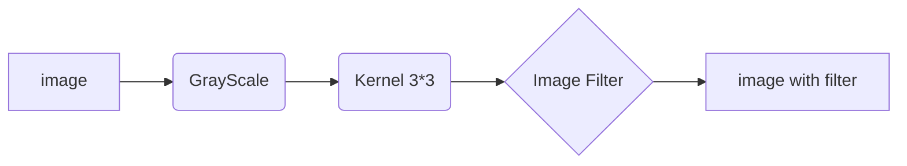

<h1 align="center">
  <br>
  <a href="https://github.com/Awrsha/Image-kernel-Without-Padding"></a>
  <br>
  MRL Humanoid - Vision Task
  <br>
</h1>

<b><h4 align="center">.:: Image Kernel without Padding ::.</h4></b>

<p align="center">
<a href="https://github.com/"></a>
<a href="https://github.com/"></a>
<a href="https://github.com/Awrsha/Image-kernel-Without-Padding/blob/main/LICENSE.md"></a>
<a href="https://github.com/Awrsha/Image-kernel-Without-Padding/network/members"></a>
</p>


<br />
<div align="center">
   <h1>Welcome to our vision task  </h1>
</div>
<div align="center">
</div>
<br />

<br /> 
Click here for 🔗 :
[Demo](https://setosa.io/ev/image-kernels)
<br /> 

## Languages
<code>
   
</code>


## Image Kernels ⚙️
An image kernel is a small matrix used to apply effects like the ones you might find in Photoshop or Gimp, such as blurring, sharpening, outlining or embossing. They're also used in machine learning for 'feature extraction', a technique for determining the most important portions of an image. In this context the process is referred to more generally as "convolution" (see: [convolutional neural networks](https://en.wikipedia.org/wiki/Convolutional_neural_network))

<br /> 

<div align="center">

</div>

<br/><br/>

## What does Sobel filter do in image processing?

The Sobel filter is used for edge detection. It works by calculating the gradient of image intensity at each pixel within the image. It finds the direction of the largest increase from light to dark and the rate of change in that direction.

## What does Blur filter do in image processing?

Blurring an image is a process that makes the image less sharp and reduces its level of detail. It distorts the detail of an image which makes it less clear.

## Why use blur filters?

Use Blur filters to simulate the real-world blurring that occurs due to the depth of field in photographed material, or to create designed effects. There are 12 Blur filters: Channel Blur gives you control over blurring each color channel of an object. Circle Blur creates a circular blur within an image.

for apllying **Blur** kernel (3*3).
 ```sh
  [ 0.0625, 0.125, 0.0625
    0.125,  0.25,  0.125 
    0.0625, 0.125, 0.0625 ]
```
## What does emboss filter do in image processing?

Traces high-contrast edges in the image with darker versions of the color in the image. This gives the layer the appearance of being stamped into the canvas, while retaining the colors of the original image. The Direction and amount of Relief can be customized.

for apllying **Emboss** kernel (3*3).
 ```sh
  [ -2, -1, 0
    -1, 1, 1
     0, 1, 2 ]
```
## What are sharpening filters?

Sharpening filters are a type of image processing that enhances the contrast between neighboring pixels, making the edges and details more visible and defined. Sharpening filters can also reduce the effects of noise, blur, or compression artifacts that degrade the quality of digital images.

for apllying **Sharpen** kernel (3*3).
 ```sh
  [ 0, -1, 0
   -1, 5, -1
    0, -1, 0 ]
```
## More information:

For sharpen & Sobel for example, the goal is to see the edge better. So a difference operator (would be an approximation to derivative here) would help you see the change in neighboring pixels. So a partial derivative can be across or horizontal, so can the difference operator. For example, horizontal difference operator using central difference would be [1 0 -1]. In the case of Sobel, it differentiates and average, hence [1 2 1]^T * [1 0 -1] where [1 2 1] is an averaging operator with more emphasis in the center pixel. A second derivative, approximated with central difference would take on 5 star stencil , [ [ 0 1, 0] [1 -4 1] [0 1 0] ]. Similarly for 3x3 mean smoothing , you average all your neighbors, so it will be 3x3 matrix of 1's divided by 9. These then serve as a motivation for the shape/pattern of the kernel, you can then do something fancier, like [ [ 0 1, 0] [1 -5 1] [0 1 0] ] instead of [ [ 0 1, 0] [1 -4 1] [0 1 0] ] to emphasize mid pixel's difference to neighbor or a mean smoothing that is less affected by neighbors, so has kernel [ [ 0.1 0.1, 0.1] [0.1 1 0.1] [0.1 0.1 0.1] ] / 1.8. Others kernel probably has it's own logic and interpretation as well.

for apllying **Outline** kernel (3*3) :
```sh
  [ -1, -1, -1
    -1, 8, -1
   -1, -1, -1 ]
```
  
for apllying **Identity** kernel (3*3) :
 ```sh
  [ 0, 0, 0
    0, 1, 0
    0, 0, 0 ]
```

## UML diagrams 📊

And this will produce a flow chart:



## Download OpenCV 📥
Download OpenCV in this site 🔗 ([Download Offline Installers | Source Package Offline Installer | Clone in Terminal](https://opencv.org/releases/))

## If You have Error 🐞
* for linux:
    * For easily execute the code, it is better to first make sure that the required versions are up-to-date before starting.
run this commands in your **ubuntu terminal** for get necessary package.
1. 
  ```sh
  sudo apt-get install build-essential -y
  ```
 2. 
  ```sh
  sudo apt-get install clang -y
  ```

## Don't run this file ! ⚠️

**.gitignore**  there is no need to run and that makes with your editor.

## Report Link 📚

Report for this task with **PDF** format ([Change Soon](https://www.qt.io/offline-installers))

## License 
[](https://licenses.com)

All  sources are without special license and copyright [No license]().

## Developers 👨🏻‍💻
<p align="center">
<a href="https://github.com/Awrsha"><br /><sub><b>.:: Amir M. Parvizi ::.</b></sub></a>
</p>
<p align="center">
<a href="https://github.com/elaheyaghoubi"><br /><sub><b>.::Elahe Yaghoubi ::.</b></sub></a>
</p>

##  System & Hardware 🛠
<br>
  <summary><b>⚙️ Things I use to get stuff done</b></summary>
  	<ul>
  	    <li><b>OS:</b> Ubuntu 22.04 LTI</li>
	    <li><b>Laptop: </b>TUF Gaming</li>
	    <li><b>Code Editor:</b> VSCode - The best editor out there.</li>
	    <li><b>To Stay Updated:</b> Medium, Linkedin and Twitter.</li>
	    <br />
	⚛️ Checkout Our VSCode Configrations <a href="">Here</a>.
	</ul>	
<p align="center">💙 If you like my projects, Give them ⭐ and Share it with friends!</p>
</p>

<p align="center">

</p>
